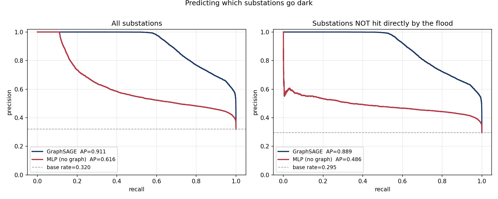
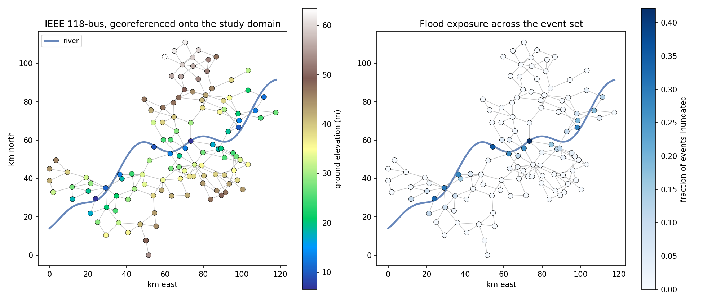
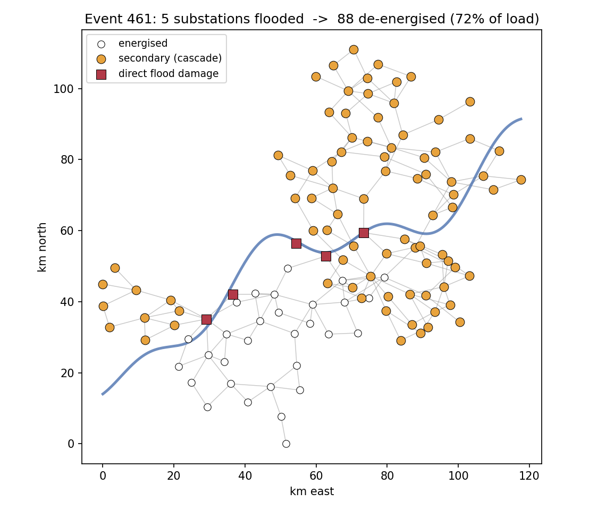
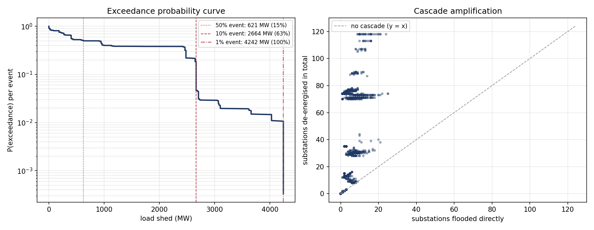
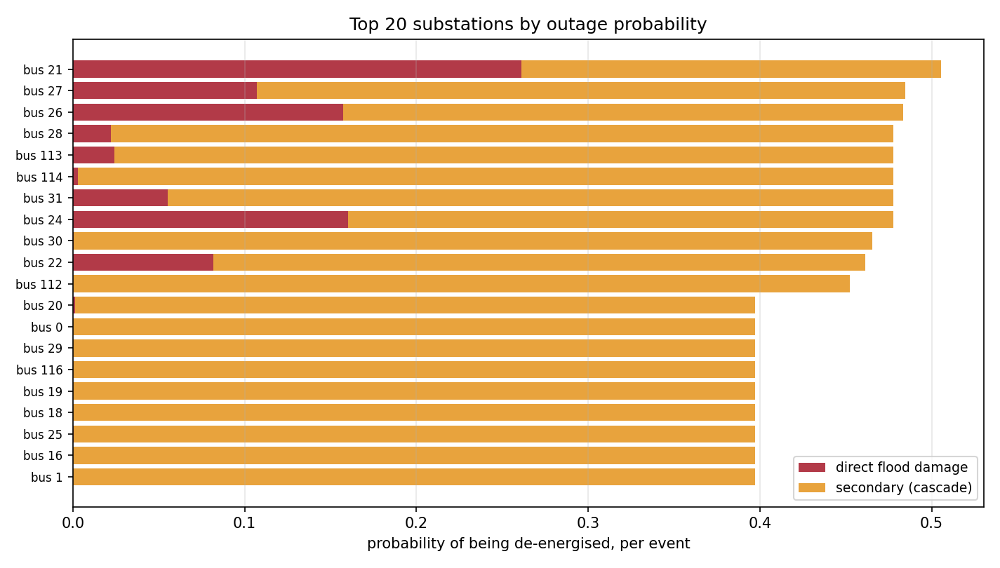

# Flood-Induced Cascading Failure in Power Networks

A small, end-to-end, simulation-driven model of how a river flood knocks out
substations, how those outages cascade through the rest of the transmission
network, and whether a graph neural network can learn to predict the result
without re-running the simulation.

Everything here runs on a laptop CPU in about ten minutes, from a clean
checkout, with no data downloads.

```
flood event set  ->  depth at each substation  ->  fragility  ->  cascade  ->  GNN surrogate
  (stochastic)         (hazard footprint)        (P of failure)   (DC power flow)   (PyTorch Geometric)
```

---

## The problem this is about

Cascading infrastructure failures are rare, and the ones that have happened
were not instrumented in a way that produces a training set. You cannot fit a
model to a few dozen historical blackouts and expect it to generalise.

The way around this is the way catastrophe modelling has handled the same
problem for thirty years: do not fit the hazard, **generate** it. Build a
stochastic event set, push each event through a physical damage model, and
treat the resulting distribution of outcomes as the object of study. The data
scarcity moves from being a blocker to being the reason for the method.

This repo does that for one specific coupling, flood to electricity, and then
asks a second question: once you have simulated thousands of scenarios, can a
GNN learn the mapping well enough to stand in for the simulator?

---

## What actually happens, step by step

**1. The network.** `src/network.py` loads the IEEE 118-bus test system through
`pandapower` and builds a `networkx` graph from its lines and transformers
(118 buses, 179 edges, 4,242 MW of load).

The 118-bus case is synthetic and has no real location, so it is affine-mapped
onto a 120 km x 110 km study domain and given a synthetic terrain: a river
running across the domain, with ground elevation rising away from the channel
plus smooth spatial texture. This is a modelling assumption, stated here and
in the code, not a claim about any real utility's grid.

**2. The hazard.** `src/hazard.py` samples a stochastic flood event set. Each
event draws a severity (lognormal peak water surface rise at the channel), a
reach of the river that floods, and decays laterally away from the channel.
Water surface elevation minus ground elevation gives inundation depth at each
substation.

This is the same three-part structure as a commercial CAT model: event set,
intensity footprint, intensity at each exposure location. `depths_from_raster()`
is a drop-in replacement that reads a real flood depth GeoTIFF (FEMA NFHL, a
hydraulic model output, First Street) and samples it at the substation
coordinates. Nothing downstream changes.

**3. Fragility.** `src/fragility.py` converts depth to a probability of
substation failure with a lognormal fragility curve,
`P(fail | d) = Phi(ln(d/theta)/beta)`, where higher-voltage substations are
assumed to be better protected. This is the same mathematical object as a
vulnerability curve in a CAT model. A Bernoulli draw turns probabilities into
the initial set of destroyed substations.

**4. The cascade.** `src/cascade.py` is the engine. Loop until nothing more
changes:

1. take failed substations out of service;
2. de-energise anything with no remaining path to a source;
3. solve a DC power flow on what is left;
4. trip every branch loaded above its rating;
5. repeat.

**5. The surrogate.** `src/simulate.py` runs 3,000 events and records, for every
substation in every event, eleven features (flood depth, fragility output,
direct-failure flag, elevation, distance to river, voltage, load, generation,
degree, betweenness, event severity) and one label (de-energised at the end).
`src/models.py` and `src/train.py` then train two models on that data.

---

## The experiment

The whole point is the comparison between two models that see **identical
inputs** and differ in one respect only:

| | sees node features | sees the graph |
|---|---|---|
| **GraphSAGE** (`CascadeGNN`) | yes | yes, 3 hops |
| **MLP** (`NodeMLP`) | yes | no |

Two things had to be right for the comparison to mean anything.

**Split by event, not by node.** Every node in one event shares a flood, a
graph and a cascade. Splitting by node would leak the answer across the split
and inflate every metric.

**Score secondary failures separately.** A substation the flood destroyed
directly is trivially predictable, because feature 2 literally says so.
Overall AUC is therefore flattered by the easy cases. The honest question is
whether a model can identify substations that **survived the water** and went
dark anyway because the network around them collapsed. That is the
`secondary_*` row, and it is the one to read.

### Results

3,000 events, split 70/15/15 by event, 25 epochs, held-out test set:

| metric | GraphSAGE | MLP (no graph) | delta |
|---|---:|---:|---:|
| ROC-AUC, all nodes | **0.949** | 0.775 | +0.174 |
| PR-AUC, all nodes | **0.911** | 0.616 | +0.295 |
| ROC-AUC, secondary only | **0.943** | 0.747 | +0.196 |
| **PR-AUC, secondary only** | **0.889** | 0.486 | **+0.404** |

Base rate of failure among nodes not hit directly: 0.295.



The gap is widest exactly where it should be. Without the graph, the MLP can
learn "deep water and low ground means trouble" and little else; on secondary
failures it lands at 0.486 PR-AUC against a 0.295 base rate, barely better
than knowing which buses are usually fragile. With three hops of message
passing, the GNN reaches 0.889. The information that closes that gap is not in
any node's own features. It is in who the node is connected to.

That is the result worth stating plainly: **for this system, most of the
predictable structure in cascading failure is topological, not hazard-local.**

---

## What the simulation itself says



Only about a quarter of the network sits close enough to the river to be
inundated at all. Everything else fails, when it fails, for network reasons.



A representative event: a handful of flooded substations near the centre of the
network take down many times their own number.



Left: the exceedance probability curve for load shed, the standard summary of
a simulation-driven risk model, applied to megawatts instead of dollars. The
median event sheds around 14% of system load; the 1-in-100 event sheds
essentially all of it.

Two features of this distribution are worth noticing.

**It is heavy-tailed and cascade-driven.** Across 3,000 events the flood
destroys 4.0 substations on average but 36.1 end up de-energised, an
amplification factor of about nine. The right panel of the exceedance figure
shows this directly: almost every point sits far above the y = x line.

**It is multi-modal, not smooth.** The curve has visible plateaus, and the
amplification scatter shows horizontal bands rather than a cloud. The system
does not degrade gracefully. It has a small number of discrete collapse modes
determined by which corridor the flood severs, and outcomes cluster around
them. This is the kind of structure that a purely statistical model fitted to
sparse history would never recover, and it is an argument for simulation
rather than an artefact of it.



Ranking substations by outage probability separates two different kinds of
critical asset: those that are exposed (they flood) and those that are
structurally important (they go dark because of what happens elsewhere). Only
the first kind can be protected with a flood wall.

---

## Sensitivity: the one knob that matters

The IEEE 118-bus case ships without real thermal ratings, so ratings are
derived from the intact base case as `headroom x |base-case flow|`. That
headroom factor is the single most influential assumption in the model, so
here is the whole sweep rather than just the chosen value (140 events each):

| headroom | mean substations lost | median | mean load shed | full blackouts |
|---:|---:|---:|---:|---:|
| 1.5 | 85.2 | 117 | 72.3% | 57.1% |
| 2.0 | 43.9 | 32 | 35.8% | 5.0% |
| **2.5 (default)** | **40.2** | **30** | **32.6%** | **1.4%** |
| 3.5 | 33.1 | 29 | 24.9% | 1.4% |
| 5.0 | 31.7 | 28 | 23.5% | 1.4% |

At 1.5 the system is absurdly brittle and over half of all events end in total
blackout, which is not a useful model of anything. Above about 3.5 the results
stop moving: the median settles near 28 to 30 substations no matter how much
thermal headroom the branches are given. That residual is **not** overload at
all, it is pure connectivity loss, buses cut off from the source with no path
back. Knowing which part of the damage is topological and which part is
thermal is exactly the sort of thing this kind of model is for.

2.5 was chosen as the default because it is inside the flat region but still
produces a meaningful spread of outcomes rather than a degenerate one.

---

## Limitations

Stated in full, because a model like this is only useful if you know where it
stops.

- **The grid is synthetic and so is the terrain.** The 118-bus case is a test
  system; the river, the elevation surface and the georeferencing are all
  constructed. The pipeline is real, the map is not.
- **The fragility parameters are illustrative.** Median capacities of 1.2 to
  2.2 m by voltage class are plausible placeholders, not published values, and
  no real substation asset data was used.
- **DC power flow.** Real power only. No voltage collapse, no reactive power,
  no losses, no transient stability. Standard for cascade screening, and the
  reason results should be read as relative rather than absolute.
- **Islands are lost, not re-dispatched.** Anything disconnected from the
  single reference bus is treated as dark. A real system with black-start and
  islanding capability would shed less load, so these numbers are pessimistic.
- **Protection is instantaneous and deterministic.** No relay timing, no
  operator intervention, no automatic load shedding, no restoration.
- **Only one interdependency is modelled.** Telecoms, water and transport all
  couple to power and none of them are here.
- **The GNN is a surrogate for this simulator, not for reality.** It reproduces
  the model's behaviour, and inherits every assumption above.

## Where this would go next

- Swap the synthetic event set for real FEMA NFHL depth grids over a real
  utility footprint (`hazard.depths_from_raster` already takes them).
- Add a second interdependent layer (telecoms) and let failure propagate
  across layers, which is where GNNs start to earn their keep over simpler
  network measures.
- Compare against a proper AC cascade model to quantify how much the DC
  approximation costs.
- Use the trained surrogate for the thing surrogates are actually for: fast
  search over mitigation options, which substations to flood-proof first,
  under a budget constraint.

---

## Repo layout

```
src/network.py     grid, georeferencing, terrain, graph construction
src/hazard.py      stochastic flood event set + real-raster adapter
src/fragility.py   depth -> substation failure probability
src/cascade.py     DC power flow cascading failure engine
src/simulate.py    scenario generation -> data/scenarios.npz
src/models.py      GraphSAGE and the no-graph MLP control
src/train.py       event-level splits, training, honest scoring
src/figures.py     the five figures above
run_all.sh         reproduce everything
```

Every module runs standalone as a self-check, e.g. `python src/cascade.py`
prints a worked single cascade.

## Reproduce

```bash
pip install -r requirements.txt
bash run_all.sh
```

or step by step:

```bash
export PYTHONPATH=src
python src/simulate.py --events 3000 --seed 42     # ~3 min
python src/train.py --epochs 25 --batch-size 128   # ~2 min
python src/figures.py
```

## References

- IEEE 118-bus test case, via `pandapower.networks`.
- Dobson, Carreras, Lynch & Newman (2007), *Complex systems analysis of series
  of blackouts*, Chaos 17(2) — cascading failure as an overload redistribution
  process.
- Hines, Cotilla-Sanchez & Blumsack (2010), *Do topological models provide good
  information about electricity infrastructure vulnerability?*, Chaos 20(3) —
  the case for flow-based rather than purely topological cascade models.
- Hamilton, Ying & Leskovec (2017), *Inductive representation learning on large
  graphs* (GraphSAGE).
- FEMA National Flood Hazard Layer, for real depth grids.

